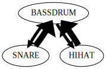

# Mégra Tutorial, Chapter 1 - Basic Concepts

Welcome to the Mégra tutorial ! Assuming you've got everything up and running, we can start to make some sound !

In this first part, we'll cover the very basic concepts of Mégra. It'll make you familiar with the terminology and some
of the underlying theory. It'll cover the first and fundamental way how to write music in Mégra. It's a bit tedious, but there's
more concise methods later on, so bear with me here. There's a file with commented examples named `For_The_Impatient.megra`, if
that's your preference.

## 1.1 Soundcheck!
Make sure your headphones are not too lound. 

Now, type the following lines of code into Portacle (or copy/paste them), move the cursor to somewhere in between the outer
parenthesis and hit `Ctrl-<return>` to run them:

```lisp
(sx 'first t
    (infer 'beep
           :events 'tone (sine 'a4 :lvl 0.5 :dur 500) 
	   :rules '((tone) tone 100 1000)))
```

If nothing went wrong, you should hear a steady beeping now. This means we're ready to start. So, to stop the beeping before it gets too annoying, type and run:

```lisp
(stop) ;; Silence ! 
```

## 1.2 Basic Things
### Some Terminology

Across this Tutorial, you'll find some words that might need some explanation in this context.

* An **Event** is an abstract description of a sound, rather than the sound itself. It contains the information that is needed to generate sound, in the form of **Parameters**.
* A **Generator** is something that emits events at certain time intervals. Sometimes also called **Source** or **Sequence Generator** because it produces a sequence of events.
* A **Sink** is something that receives the events and sends them somewhere where the abstract description is turned into actual sound.

### Basic Characteristics of Mégra

1. Mégra is mostly suited to create musical structures (as opposed to create synths).
2. Mégra is mostly suited to write *sequence generators*.
3. It has some synthesis aspects, but that's currently not its strongest side.
4. Mégra uses *Variable-Order Markov Chains* as its basic data structure. We'll explain that later on.
5. Mégra uses *Probabilistic Finite Automata*, which is a specific representation of *Variable Order Markov Chains*.

### Syntax 

If you're not familiar with basic Lisp syntax, I'd recommend by just tagging along and learn by experience. You don't need to know
Lisp to play with Mégra. Here's just a few basic hints:

1. Function calls look like this: `(my-function <params>)`.
2. Everything is enclosed by parenthesis. If a parenthesis isn't closed, you'll get an error.
3. Named parameters start with a colon: `(my-function <unnamed param> :name <named param>)`
4. Symbols, that are used here to identify things, are *quoted* with a single quote: `(my-function 'some-name :par <some param>)`.
5. Lists are also quoted: `(my-function 'some-name-param :list-param '(1 2 3 4))`.

## 1.3 Markov Chains
If you're into generative music, you probably know already what a *Markov Chain* is, as it is a fairly common structure in that domain. 
If not, here's a simple explanation. Even if you know them already, I'd recommend reading the following part to get to know the specific 
"flavour" of Markov Chains employed by Mégra.

Imagine you want to create a simple *boom-bap* style beat, with just a bassdrum, a snare and some hi-hats. 
Only half the time the hi-hat should be in between the bassdrum and the snare. 

In slightly more precise terms, we could describe the beat with the following rules. The natural language description
is a bit tedious, but bear with me here. More concise descriptions will follow! 

1. Start with a bassdrum.
2. There's a 50% chance that a snare will follow the bassdrum, after 400 milliseconds.
3. There's a 50% chance that a hi-hat will follow the bassdrum, after 200 milliseconds.
4. After every snare will follow a bassdrum, after 400 milliseconds.
5. After every hi-hat will follow a snare, after 200 milliseconds.

This could be easily represented graphically:

 

This representation is called a *directed graph* (as each arrow has a direction), that has a couple of *nodes* and *edges* that 
connect the nodes. Sometimes I use the words *edge* and *transition* synonymously here ... 

Now, Mégra has a fairly direct way to create sequence generators based on Markov chains. A *generator* is something that emits 
musical *events*. The generator above can be written in Mégra with the following lines of code:

```lisp
(sx 'boom t ;; <- this turns the events into actual sounds. More about that later! 
    (infer 'bal ;; <- this creates the generator (infers it from rules)
           :events 'bassdrum (bd) 'snare (sn) 'hihat (hats) ;; <- here's the event mapping ... pretty prosaic ...
           :rules 
           '((bassdrum) snare 50 400) ;; here's the rules ... format: '((source) target probability duration)
           '((bassdrum) hihat 50 200)           
           '((snare) bassdrum 100 400)           
           '((hihat) bassdrum 100 400)))
```

This will start on the bassdrum, and move along the edges (or transitions) according to the probablities.
Each time a node is reached, the dices are thrown again, and the next node is determined.

**Aside**: I recommend drawing the following modifications with pen and paper as demonstrated above, to get a better grasp on what's going
on !

As you can see, each transition not only has a probability, but also a duration that determines the time between events. This time 
is specified in milliseconds. Play around with the probablities and durations a bit to hear how the result changes! Make sure 
that the sum of outgoing probabilities for each node is 100% ! If not, it'll still work but it might be harder to explain the 
results. 

If you look at the structure above, each event is only dependent on the immediately preceding event. In technical terms,
that's what we call a *first-order* Markov chain. They sometimes can give you neat results but generally aren't all that interesting.
That might be due to the fact that in human cognition, the expectation of the next event isn't just determined by the immediately 
preceding one, but by two, three or even more preceding events.

Can we fix that? Now, earlier there's been mentioned something about *Variable Order Markov Chains*. To imagine what this is about,
make the following modification to the beat above:

```lisp
(sx 'boom t
    (infer 'bap
           :events 'bassdrum (bd) 'snare (sn) 'hihat (hats)
           :rules
           '((bassdrum) bassdrum 80 400) ;; <- add a transition that allows the bassdrum to be repeated
           '((bassdrum) snare 10 400)
           '((bassdrum) hihat 10 200)           
           '((snare) bassdrum 100 400)           
           '((hihat) bassdrum 100 400)))
```

Now you'll mostly hear a repeated bassdrum. Wouldn't it be nice if we could add a rule like 
"repeat the bassdrum, but after 4 repetitions, definitely jump to the hi-hat"? Well, we can ! 
Add another edge in the following way: 

```lisp
(sx 'boom t
    (infer 'bap
           :events 'bassdrum (bd) 'snare (sn) 'hihat (hats)
           :rules
           '((bassdrum) bassdrum 60 400) ;; <- add a transition that allows the bassdrum to be repeated
           '((bassdrum bassdrum bassdrum bassdrum) hihat 100 200) ;; <- make sure bassdrum isn't repeated all too often
           '((bassdrum) snare 20 400)
           '((bassdrum) hihat 20 200)           
           '((snare) bassdrum 100 400)           
           '((hihat) bassdrum 100 400)))
```

Now, in most cases, the next event is still dependent only on the immediately preceding one, but on occasion, it's dependent 
on four preceding events. Hence the term *Variable-Order*, sometimes also called *Variable Memory Length*. 

We can add even more options: 

```lisp
(sx 'boom t
    (infer 'bap
           :events 'bassdrum (bd) 'snare (sn) 'hihat (hats)
           :rules
           '((bassdrum) bassdrum 80 400) ;; <- add a transition that allows the bassdrum to be repeated
           '((bassdrum bassdrum bassdrum bassdrum) hihat 70 200) ;; <- make sure bassdrum isn't repeated all too often
           '((bassdrum bassdrum bassdrum bassdrum) snare 30 400) ;; <- make sure bassdrum isn't repeated all too often
           '((bassdrum) snare 10 400)
           '((bassdrum) hihat 10 200)           
           '((snare) bassdrum 100 400)           
           '((hihat) bassdrum 100 400)))
```

Now it looks like this:
 

The labels are arbitrary, so we can reduce the amount of writing (and even more, as we can see later on):

```lisp
(sx 'boom t
    (infer 'bap
           :events 'b (bd) 's (sn) 'h (hats)
           :rules
           '((b) b 80 400) '((b b b b) h 70 200) '((b b b b) s 30 400)
           '((b) s 10 400) '((b) h 10 200)           
           '((s) b 100 400)           
           '((h) b 100 400)))
```

## 1.4 Visualization
I recommend above drawing the structures above with pen and paper, but you can also create a visualization by executing the following line:

```lisp
(to-svg 'bap)	
```

Now you'll find an SVG file named `BAP.svg` in your Portacle root folder. Unfortunately, at this time, the visualization isn't very advanced. It only shows the node labels, and also only the first order nodes. Later on we'll encounter a slightly more advanced structure, with a slightly more advanced visualization.

## 1.5 Recap
In this Chapter we've learned some of the very basic ideas of Mégra. In the first iterations of the language, this was the only way to write sequence generators. If you 
think that's pretty tedious, you're right ! But, as we'll see in the next chapter, there are ways to make the process of writing sequence generators more fun!

## 1.6 Further Reading
* If you're interested in human cognition and expectation as applied to music, I really recommend the book *Sweet Anticipation* by David Huron (https://mitpress.mit.edu/books/sweet-anticipation)
* If you want to get into the theory of *Variable Order Markov Chains*, I recommend the following paper: https://link.springer.com/content/pdf/10.1007%2FBF00114008.pdf


