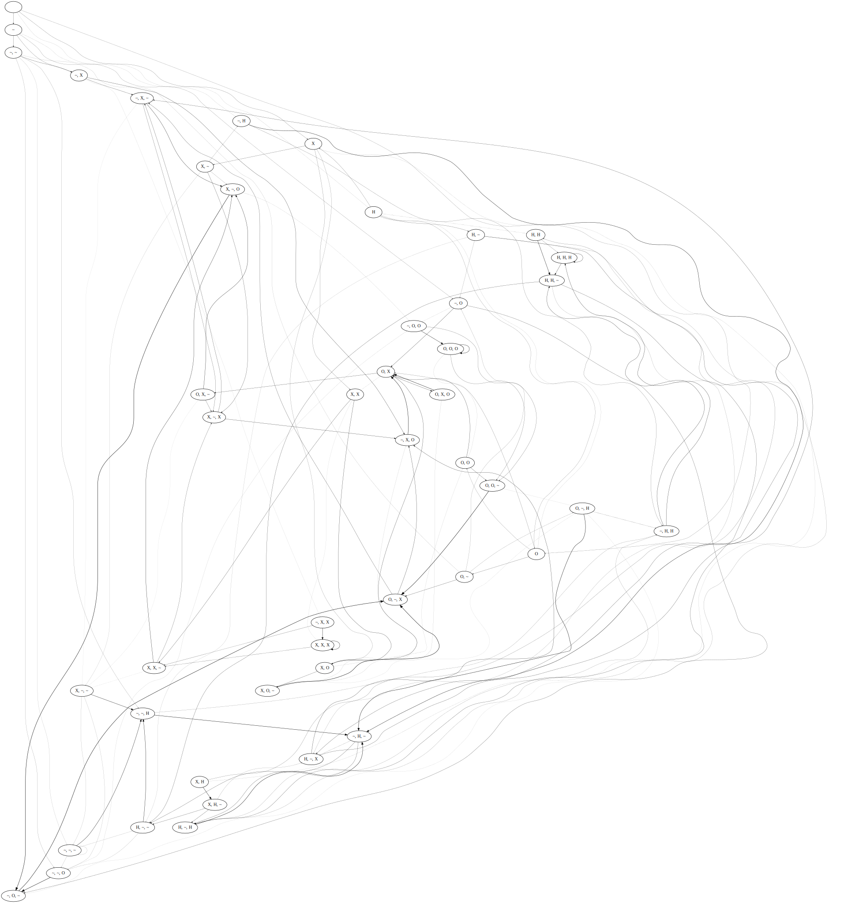

# Mégra Function Reference

Table of Contents
=================

**Generator Generators**:

* [cyc - Cycle Generator](#cyc---cycle-generator)
* [cyc2 - Cycle Generator](#cyc2---cycle-generator)
* [chop - Chop a sample](#chop---chop-a-sample)
* [friendship - Create Friendship (or Windmill) Generator](#friendship---create-friendship-generator)
* [friendship2 - Create Friendship (or Windmill) Generator](#friendship2---create-friendship-generator)
* [flower - Create Flower Generator](#flower---create-flower-generator)
* [flower2 - Create Flower Generator](#flower2---create-flower-generator)
* [fully - Create Fully Connected Generator](#fully---create-fully-connected-generator)
* [fully2 - Create Fully Connected Generator](#fully2---create-fully-connected-generator)
* [infer - Infer Generator from Rules](#infer---infer-generator-from-rules)
* [nuc - Nucleus Generator](#nuc---nucleus-generator)
* [nuc2 - Nucleus Generator](#nuc2---nucleus-generator)
* [learn - Learn Generator from Distribution](#learn---learn-generator-from-distribution)
* [pseq - Event Sequence Generated from Parameters](#pseq---event-sequence-generated-from-parameters)

**Generator Modifiers**:

* [apple - Event Stream Manipulator Probablity](#pprob---event-stream-manipulator-probablity)
* [blur - Blur Probabilities](#blur---blur-probabilities)
* [discourage - Stir Up Generator](#discourage---stir-up-generator)
* [encourage - Consolidate Generator](#encourage---consolidate-generator)
* [evr - Count-Based Generator Manipulators](#evr---count-based-generator-manipulators)
* [grow - Enlarge Generator](#grow---enlarge-generator)
* [grown - Enlarge Generator n times](#grown---enlarge-generator-n-times)
* [haste - speed up evaluation](#haste---speed-up-evaluation)
* [life - Manipulate Generator](#lifemodel---manipulate-generator)
* [probctrl - Manipulate Generator](#probctrl---manipulate-generator)
* [relax - Slow Down Generator](#relax---slow-down-generator)
* [rew - Rewind Generator](#rew---rewind-generator)
* [sharpen - Sharpen Probabilities](#blur---sharpen-probabilities)
* [shrink - Shrink Generator](#shrink---shrink-generator)
* [skip - Skip Events](#skip---skip-events)
* [xdup - Multiply Generators with Modifiers](#xdup---multiply-generators-independently)
* [xspread2 - Multiply Generators with Modifiers, Spread over Stereo Spectrum](#xdup---multiply-generators-independently)

**Parameter or Event Stream Modifiers**:

* [always - Event Stream Modificator Probablity](#always---event-stream-modificator-probablity)           
* [brownian - Bounded Brownian Motion](#brownian---bounded-brownian-motion)   
* [env - Parameter Envelope](#env---parameter-envelope)
* [exh - Event Stream Manipulator](#exh---event-stream-manipulator)
* [fade - Parameter Fader](#fade---parameter-fader)
* [inh - Event Stream Manipulator](#inh---event-stream-manipulator)
* [oscil - Parameter Oscillator](#oscil---parameter-oscillator)
* [pear - Apply Modifiers](#pear---apply-modifiers)
* [ppear - Apply Modifiers](#pear---apply-modifiers)
* [prob - Event Stream Manipulator Probablity](#prob---event-stream-manipulator-probablity)

**Misc**:

* [cmp - Compose Generators](#cmp---compose-generators)
* [clear - Clear Session](#clear---clear-session)     
* [ctrl - Control Functions](#ctrl---control-functions)
* [sx - Event Sinks](#sx---multiple-event-sinks)
* [stop - Stop Event Processing](#stop---stop-event-processing)

**Legacy Functions**:

## `always` - Event Stream Modificator Probablity

Applies an event stream modificator with probability one. Same as `pear`.

### Parameters

* modificators (list)

### Syntax

```lisp
(always <modificators>)
```

### Examples

Always apply reverb to events:

```lisp
(sx 'some t
  (cmp (always (rev 0.1)) ;; <- compose !
       (cyc 'beat "bd ~ ~ ~ sn ~ ~ ~")))
```
## `brownian` - Bounded Brownian Motion 

Define a bounded brownian motion on a parameter.

### Parameters

* lower boundary (float)
* upper boundary (float)
* `:wrap` (boolean) (t) - wrap value if it reaches lower or upper boundary
* `:limit` (boolean) (nil) - limit value if it reaches upper or lower boundary
* `:step-size` (float) (0.1) - step that the parameter will be incremented/decremented

### Syntax

```lisp
(brownian <lower boundary> <upper boundary> :wrap <wrap> :limit <limit> :step-size <step-size>)
```

### Examples

```lisp
(sx 'some t
    (cmp (always (rate (brownian 0.8 1.2)))
         (nuc 'violin (violin 'a3 :dur 200))))
```

## `chop` - Chop a sample

Chop a sample into parts, that will be played as a loop.

### Examples

```lisp
;; chop violin sample into 8 parts (each of which is 200ms long)
(sx 'some t
  (chop 'chops (violin 'a3 :dur 200) 8)) 
```

## `clear` - Clear Session

Stops and deletes some or all present generators.

### Examples

```lisp
(sx 'some t
  (cyc 'bear "bd ~ hats ~ sn ~ hats ~"))

(sx 'more t :sync 'some
  (cyc 'bass "saw:100 ~"))

(clear 'more) ;; only clear bassline
(clear) ;; clear everything
```

## `cmp` - Compose Generators

### Syntax
```lisp
(cmp <generators>)
```

### Examples

```lisp
;; The plain lisp approach would be:
(sx 'composed t
    (pear (rev 0.1)
          (evr 20 (haste 2 0.5)
               (cyc 'bl "bd ~ ~ sn ~ ~"))) )

;; this makes it somewhat inconvenient to add/disable certain parts.

;; With cmp, it can be re-written as:
(sx 'composed t
    (cmp
     (pear (rev 0.1))
     (evr 20 (haste 2 0.5))
     (cyc 'bl "bd ~ ~ sn ~ ~")) )

;; now individual modifiers can easily be commented out

```

## `ctrl` - Control Functions

Executes any function, can be used to conduct execution of generators.

### Parameters

* function

### Syntax

```lisp
(ctrl <function>)
```

### Example

```lisp
;; define some parts
(defvar part-a (cmp
                 (always (rev 0.1))
                 (nuc 'violin (violin 'a3))))

(defvar part-b (cmp
                 (always (rev 0.1))
                 (nuc 'cello (cello 'c1))))

;; Define a score, here as a cycle, even though any other generator
;; might be used.
(sx 'control t
    (cyc 'conduct
         (list
          (ctrl (sx 'orch t part-a)) 3000
          (ctrl (sx 'orch t part-b)) 3000)))
```

## `cyc` - Cycle Generator

Generates a cycle (aka loop) from a simple sequencing language.

### Parameters

* name - generator name
* sequence - sequence description
* `:dur` - default space between events 
* `:rep` - probability of repeating an event
* `:max-rep` - limits number of repetitions
* `:rnd` - random connection probability

### Syntax

```lisp
(cyc <name> <sequence> :dur <duration> :rep <repetition probability> :max-rep <max number of repetitions> :rnd <random connection prob>)
```

### Example 
```lisp
;; plain
(sx 'simple t
  (cyc 'beat "bd ~ hats ~ sn ~ hats ~"))
```

 

```lisp
;; with a 40% chance of repetition, 4 times at max
(sx 'simple t
    (cyc 'beat "bd ~ hats ~ sn ~ hats ~" :rep 40 :max-rep 4))
```
    

## `cyc2` - Cycle Generator

Generates a cycle (aka loop) from a simple sequencing language, using the advanced PFA model.

### Parameters
Same as `cyc`.

### Example

```lisp
(sx 'simple t
  (cyc2 'beat "bd ~ hats ~ sn ~ hats ~" :rep 60 :max-rep 3))
```

## `discourage` - Stir Up Generator

Looks at the last path through the graph and decreases the probablity for that sequence to happen again, effectively increasing entropy of the results. 

### Syntax

```lisp
(discourage <factor> <generator>)
```

### Parameters

* factor - discouragement factor ... the higher, the more effective
* generator - the generator to be discouraged (optional) ... name or directly

### Example

```lisp
(sx 'chaos t
  (cyc 'gen "bd ~ ~ sn sn ~ casio ~" :rep 80 :rnd 80 :max-rep 4))
  
(grow :var 0.3 'gen) ;; execute a couple times

(discourage 0.2 'gen) ;; hear what happens
```

## `encourage` - Consolidate Generator

Looks at the last path through the graph and increases the probablity for that sequence to happen again, effectively decreasing entropy of the results. 

```lisp
(encourage <factor> <generator>)
```

### Parameters

* factor - encouragement factor ... the higher, the more effective
* generator (optional) - the generator to be encouraged (optional) ... name or directly

### Example

```lisp
(sx 'chaos t
  (cyc 'gen "bd ~ ~ sn sn ~ casio ~" :rep 80 :rnd 80 :max-rep 4))
  
(grow 'gen :var 0.3) ;; execute a couple times

(encourage 'gen) ;; hear what happens
```

## `env` - Parameter Envelope

Define an envelope on any parameter. Length of list of levels must be one more than length of list of durations.
Durations are step based, so the absolute durations depend on the speed your generator runs at.

### Paramters

* levels (list) - level points on envelope path
* durations (list) - transition durations (in steps)
* `repeat` (boolean) - loop envelope 

### Syntax

```lisp
(env <levels> <durations> :repeat <t/nil>)
```

### Example

```lisp
(sx 'simple t
    (cmp (always (lvl (env '(0.0 0.4 0.0) '(20 30))))
         (cyc 'beat "bd ~ hats ~ sn ~ hats ~")))        
```

## `evr` - Count-Based Generator Manipulators

Every so-and-so steps, do something with the generator.
Does not work as a sound modifier (so far).

### Examples

```lisp
(sx 'simple t
    (cmp (evr 20 (skip 2)) ;; <- every 20 steps, skip 2
         (cyc 'beat "bd ~ hats ~ sn ~ hats ~")))        
```

## `exh` - Event Stream Manipulator

Exhibit event type, that is, mute all other events, with a certain probability.

### Parameters

* probablility (int) - exhibit probablility
* filter (filter function) - event type filter

### Syntax
```lisp
(exh <probability> <filter>)
```

### Example
```lisp
(sx 'simple t 
  (cmp (exh 30 'hats)
       (exh 30 'bd)
       (nuc 'beat (list (bd) (sn) (hats))))) 
```
## `fade` - Parameter Fader

Fade a parameter (sinusoidal).

### Syntax

`(fade <from> <to> :steps <steps>)`

### Example
```lisp

;; fade cutoff frequency
(sx 'osc t
    (nuc 'ill (saw 300 :lp-freq (fade 300 2200 :steps 20))))

;; same, but a different position 
(sx 'osc t
    (cmp
     (always (lp-freq (fade 300 2200 :steps 4)))
     (nuc 'ill (saw 300))))

;; fade duration
(sx 'osc t         
    (nuc 'ill (saw 300) :dur (fade 100 400)))

;; fade probablility
(sx 'osc t
    (cmp
     (prob (fade 0 100) (lvl 0.0))
     (nuc 'ill (saw 300))))
```

## `friendship` - Create Friendship Generator

This creates a directed version of a Friendship- or Windmill graph.

### Syntax

`(friendship <name> <list of events>)`

### Parameters

* `name` - The generator name.
* `list of events` - a list of events (more than 3, odd number)

### Example

```lisp
(sx 'friend t        
    (cmp
     (always (atk 1) (rel 90) (dur 100) (rev 0.07))
     (friendship 'ship (saw 'a2) (saw 'c3) (saw 'e3) (saw 'b3) (saw 'd3) (saw 'f3) (saw 'c4))))
```


## `friendship2` - Create Friendship Generator

Same as `friendship`, with advanced PFA model.

## `flower` - Create Flower Generator

Create ... well, look at the examples.

### Syntax:
`(flower <name> [:layers <layers>] <events>)`

### Parameters:

* `name` - generator name
* `:layers` - number of layers
* `events` - list of events (will be padded to appropriate lenght if necessary)

### Examples

Flower with 1 layer:
```lisp
(sx 'a-rose-is-a t
    (flower 'rose (saw 100)
             (saw 200) (saw 300) (saw 400)
             (saw 150) (saw 300) (saw 450)
             (saw 180) (saw 360) (saw 540)))
```


Flower with 2 layers:
```lisp
(sx 'a-rose-is-a t
    (flower 'rose :layers 2 (saw 100)
             (saw 200) (saw 300) (saw 400)
             (saw 150) (saw 300) (saw 450)
             (saw 180) (saw 360) (saw 540)))
```


## `flower2` - Create Flower Generator

Same as `flower`.

## `fully` - Create Fully Connected Generator

Each node follows each other node with equal probablity ... so basically a random generator.

### Syntax
```lisp
(fully <name> <list of events>)
```

### Example

```lisp
(sx 'full t
    (fully 'mel (saw 'a3) (saw 'f2) (saw 'c3) (saw 'e3)))

```

    

## `fully2` - Create Fully Connected Generator

Same as `fully`, with advanced PFA model.

## `grow` - Enlarge Generator


## `grown` - Enlarge Generator n times

## `haste` - Speed Up Evaluation

Speed up evaluation for a specified number of steps, by a certain ratio.

### Examples

```lisp
(sx 'more t
    (xspread2     
     (cmp ;; this is another copy with modifiers ...
          (always (pitch-mul 3.0))
          (evr 20 (haste 4 0.5))) ;; <- every 20 steps, double-time for four steps. Change to 0.25 for quadruple-time, etc
     ;; this is the "original" 
     (cyc 'one "shortri:'f3 shortri:'a3 shortri:'c4 shortri:'e4 ~ ~ shortri:'f3 shortri:'a3 shortri:'c4 shortri:'e4 ~")))
```

## `inh` - Event Stream Manipulator

Inhibit event type, that is, mute event of that type, with a certain probability.

### Parameters

* probablility (int) - inhibit probablility
* filter (filter function) - event type filter

### Syntax

```lisp
(inh <probability> <filter>)
```

### Example

```lisp
(sx 'simple t
  (cmp (inh 30 'hats)
       (inh 30 'bd)
       (inh 30 'sn)
       (nuc 'beat (~ (bd) (sn) (hats)))))
```

## `life` - Manipulate Generator

This is one of the more complex generator manipulations.

## `nuc` - Nucleus Generator

Generates a one-node repeating generator, i.e. as a starting point for growing.

### Parameters

* name (symbol)
* event(s) (event or list of events) - events to be repeated
* `:dur` - transition duration between events

### Syntax

```lisp
(nuc <name> <event(s)> :dur <duration>)
```

### Example

```lisp
(sx 'just t
  (nuc 'bassdrum (bd) :dur 400))
```
    

## `nuc2` - Nucleus Generator

Generates a one-node repeating generator, i.e. as a starting point for growing, based on PFA model.

Everything else same as `nuc`.

## `oscil` - Parameter Oscillator

Define oscillation on any parameter. The oscillation curve is a bit bouncy, not really sinusoidal.

### Parameters 

* upper limit - upper limit for oscillation 
* lower limit - lower limit for oscillation 
* `:cycle` - oscillation cycle length in steps

### Syntax

```lisp
(oscil <upper limit> <lower limit> :cycle <cycle length in steps>)
```

### Example

```lisp
(sx 'simple t
  (nuc2 'beat (bd) :dur (oscil 200 600 :steps 80)))
```

## `pear` - Apply Modifiers

Appl-ys and Pears ...

## `probctrl` - Manipulate Generator

## `prob` - Event Stream Manipulator Probablity

## `pprob` - Event Stream Manipulator Probablity

## `pseq` - Event Sequence Generated from Parameters

## `relax` - Slow Down Generator

Slows down generator for a specified number of steps, by a certain ratio.

### Examples

```lisp
(sx 'more t
    (xspread2     
     (cmp ;; this is another copy with modifiers ...
          (always (pitch-mul 3.0))
          (evr 20 (relax 4 0.5))) ;; <- every 20 steps, half-time for four steps
     ;; this is the "original" 
     (cyc 'one "shortri:'f3 shortri:'a3 shortri:'c4 shortri:'e4 ~ ~ shortri:'f3 shortri:'a3 shortri:'c4 shortri:'e4 ~")))
```

## `rew` - Rewind Generator

Re-winds the generator by a specified number of steps. The further unfolding might
be different from the previous one, obviously.

### Examples

```lisp
(sx 'more t
    (xspread2     
     (cmp ;; this is another copy with modifiers ...
          (always (pitch-mul 3.0))
          (evr 20 (rew 2))) ;; <- every 20 steps, rewind 2 steps (only the copy)
     ;; this is the "original" 
     (cyc 'one "shortri:'f3 shortri:'a3 shortri:'c4 shortri:'e4 ~ ~ shortri:'f3 shortri:'a3 shortri:'c4 shortri:'e4 ~")))
```

## `shrink` - Shrink Generator

## `skip` - Skip Events

## `sx` - Event Sink

Allows for temporal independece of generators, unlike old `(s ...)`

### Example

```lisp
(sx 'simple t
  (nuc2 'beat (bd) :dur 400))

(sx 'simple2 t :sync 'simple :shift 200
  (nuc2 'beat2 (sn) :dur 400))
```

## `learn` - Learn Generator from Distribution

### Example
```lisp
(sx 'from t
    (learn 'data
           :events 'x (bd) 'o (sn) '~ (silence) 'h (hats)
           "xoxoxoxox~~o~h~~~h~h~h~~h~h~~hhh~x~o~x~o~x~o~x
            ~o~xh~h~~hhh~x~o~x~o~x~o~xox~xox~xox~xoxo~xoxo
            ~xoxox~oooo~xxxx~xoxoxox~ohxhohxhohxhxhxhxhxhx
            hxhohohoh"))
```
    

## `infer` - Infer Generator from Rules

Infer a generator from arbitrary rules. Make sure every event has
at least one exit, otherwise the generator will stop.

Also, exit probablities for each node should add up to 100.

### Parameters

* `name` - generator name
* `:events` - event mapping
* `:type` - pfa type ('naive or 'pfa) (optional)
* `:rules` - transition rules - Format '((<source>) <destination> <probability> <duration (optional)>)

### Example

```lisp
(sx 'from t
    (infer 'rules
           :events 'x (bd) 'o (sn) '~ (silence) 'h (hats)
           :rules
           '((x) x 40)
           '((x x x) ~ 40) ;; 3 reps max
           '((x) ~ 30) '((x) h 30)
           '((h) ~ 30)
           '((h) o 50)
           '((h) h 20)
           '((h h h) o 20)
           '((~) o 33)
           '((~) h 33)
           '((~) x 34)
           '((o) ~ 50)
           '((o) o 25)
           '((o) x 25)
           '((o o o) ~ 100)))
```


## `stop` - Stop Event Processing

Stop event processing without deleting generators, thus maintaining current state.

## `xdup` - Multiply Generators Independently

If you want to juxtapose (obvious reference here) a generator with a modified copy of itself,
without re-writing the whole generator. 

### Example
```lisp
(sx 'more t
    (xdup
     (cmp ;; this is the copy with modifiers ...
      (always (pitch-mul 2.0) (rev 0.1))
      (evr 20 (haste 2 0.5)))     
     ;; this is the "original" 
     (cyc 'one "shortri:'f3 shortri:'a3 shortri:'c4 shortri:'e4 ~ ~ shortri:'f3 shortri:'a3 shortri:'c4 shortri:'e4 ~")))
```

## `xspread` - Multiply Generators Independently

If you want to juxtapose (obvious reference here) a generator with a modified copy of itself,
without re-writing the whole generator. As opposed to `xdup`, this one spreads the copies over
the stereo spectrum.

### Example
```lisp
(sx 'more t
    (xspread2
     (cmp ;; this is the copy with modifiers ...
          (always (pitch-mul 2.0) (rev 0.1))
          (evr 20 (haste 2 0.5)))
     (cmp ;; this is another copy with modifiers ...
          (always (pitch-mul 4.02) (rev 0.1))
          (evr 20 (haste 3 0.5)))     
     ;; this is the "original" 
     (cyc 'one "shortri:'f3 shortri:'a3 shortri:'c4 shortri:'e4 ~ ~ shortri:'f3 shortri:'a3 shortri:'c4 shortri:'e4 ~")))
```


